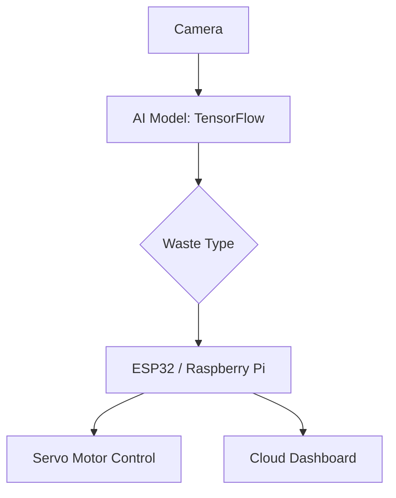

# ♻️ Smart Waste Segregation System using AI

An intelligent waste classification model built with Computer Vision and TensorFlow to automatically detect and categorize waste into **plastic**, **metal**, **organic**, and **e-waste**. This project promotes environmental sustainability and smart city infrastructure.

---

## 📌 Features

- 🧠 AI-based image classification of waste
- 🚮 Categorizes waste into: `plastic`, `paper`, `metal`, `organic`, `ewaste`
- ⚙️ Converts model to TensorFlow Lite for edge device deployment
- 📊 Integrates with IoT systems for smart bin management
- 🌐 Easily extendable to real-time camera feed, mobile apps, or embedded systems

---

## 📂 Folder Structure

```
smart-waste-ai-model/
├── data/
│   ├── train/        # Training images by class
│   └── val/          # Validation images by class
├── models/           # Saved models (.h5, .tflite)
├── scripts/
│   ├── train.py      # Model training script
│   ├── predict.py    # Inference script
│   └── convert_tflite.py # Convert model to .tflite
├── test_images/      # Test samples for prediction
├── notebooks/        # (Optional) Jupyter notebooks
├── requirements.txt  # Python dependencies
└── README.md         # Project documentation
```

---

## 🛠️ How It Works



- 📸 Camera captures waste image  
- 🧠 AI model predicts the type of waste  
- 🪛 Microcontroller sorts waste using actuators  
- ☁️ Sensor data (weight, level) sent to dashboard via MQTT/HTTP  

---

## 🚀 Getting Started

1. **Install dependencies**
    ```bash
    pip install -r requirements.txt
    ```

2. **Prepare dataset**  
   Organize your images as follows:
    ```
    data/
      train/
        plastic/  metal/  organic/  ewaste/
      val/
        plastic/  metal/  organic/  ewaste/
    ```

3. **Train the model**
    ```bash
    python scripts/train.py
    ```

4. **Predict a test image**
    ```bash
    python scripts/predict.py test_images/sample.jpg
    ```

5. **Convert to TensorFlow Lite (optional)**
    ```bash
    python scripts/convert_tflite.py
    ```

## 🙌 Contributing

We welcome contributions from everyone! Here’s how you can help:

- 📸 Add more waste images for training
- 🧪 Improve model architecture or accuracy
- 🐛 Report or fix bugs in training/prediction scripts
- 📈 Add visual dashboards or analytics
- 🔌 Connect with real-world hardware (e.g., servo motors, ultrasonic sensors)

**How to contribute:**
1. Fork this repo
2. Create a new branch:  
   `git checkout -b feature/your-feature-name`
3. Commit your changes:  
   `git commit -am 'Add new feature'`
4. Push to the branch:  
   `git push origin feature/your-feature-name`
5. Open a Pull Request

---

## 🧠 License & Acknowledgments

- 🤖 Model inspired by open-source waste classification datasets
- 📚 Based on TensorFlow and OpenCV
- 📷 Dataset credits: TrashNet, RealWaste, and others
- 🔓 MIT License

---

## ✨ Connect with Us

If you are passionate about sustainability, AI, or hardware integration — we’d love to collaborate!

💬 Let's build smarter and greener cities together 🌍
